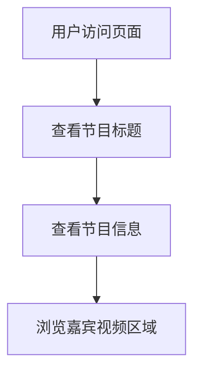

# 视频播客画面模板页面 - 产品需求文档

## 1. Product Overview
开发一个基于 React 的视频播客画面模板页面，专为横屏展示设计，用于展示播客节目的标题、嘉宾信息和视频画面布局。
- 主要解决播客节目录制时的画面展示需求，为观众提供清晰的节目信息和嘉宾展示界面。
- 目标用户为播客制作团队和内容创作者，帮助他们快速搭建专业的节目展示页面。

## 2. Core Features

### 2.1 Feature Module
我们的播客画面模板包含以下主要页面：
1. **主展示页面**：标题区域、节目信息区域、三列视频展示区域。

### 2.2 Page Details

| Page Name | Module Name | Feature description |
|-----------|-------------|---------------------|
| 主展示页面 | 标题区域 | 在页面顶部居中显示播客节目标题，使用醒目的字体和样式 |
| 主展示页面 | 节目信息区域 | 显示节目Logo（正方形占位）和节目名称，位于标题下方 |
| 主展示页面 | 视频展示区域 | 采用一行三列布局，每列包含9:16比例的视频占位区域和对应的人物信息 |
| 主展示页面 | 人物信息模块 | 在每个视频区域下方显示人物姓名、角色描述等信息 |

## 3. Core Process
用户访问页面后，可以直接查看播客节目的完整信息展示：
1. 首先看到页面顶部的节目标题
2. 然后查看节目Logo和名称信息
3. 最后浏览三个嘉宾的视频展示区域和相关信息

## 4. User Interface Design

### 4.1 Design Style
- 主色调：深色背景配合亮色文字，营造专业播客氛围
- 次要颜色：使用蓝色或绿色作为强调色
- 按钮样式：圆润边框设计，与整体风格保持一致
- 字体：使用现代无衬线字体，标题使用较大字号（24-32px），正文使用中等字号（16-18px）
- 布局风格：卡片式设计，顶部导航布局
- 图标风格：简洁的线性图标或实心图标

### 4.2 Page Design Overview

| Page Name | Module Name | UI Elements |
|-----------|-------------|-------------|
| 主展示页面 | 标题区域 | 居中布局，大号字体，深色背景上的白色文字，适当的上下边距 |
| 主展示页面 | 节目信息区域 | 水平布局，左侧正方形Logo占位，右侧节目名称，使用卡片样式 |
| 主展示页面 | 视频展示区域 | 三列等宽布局，每列包含圆润边框的9:16视频占位区域，深灰色背景 |
| 主展示页面 | 人物信息模块 | 位于视频下方，包含姓名（粗体）和角色描述（常规字体），左对齐 |

### 4.3 Responsiveness
项目专为1920x1080分辨率的横屏展示设计，不考虑移动端适配和触摸交互优化。