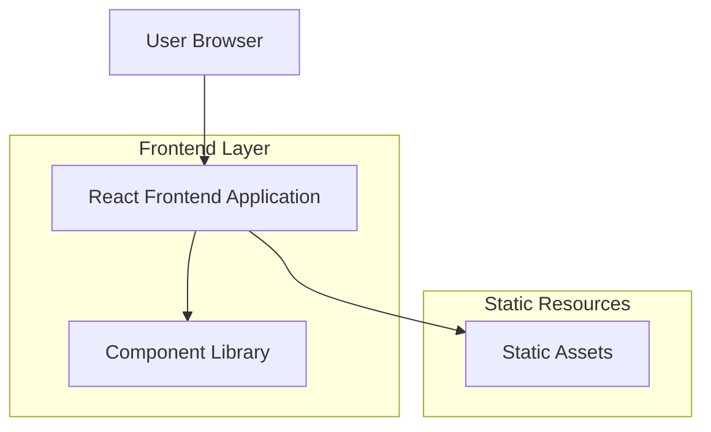
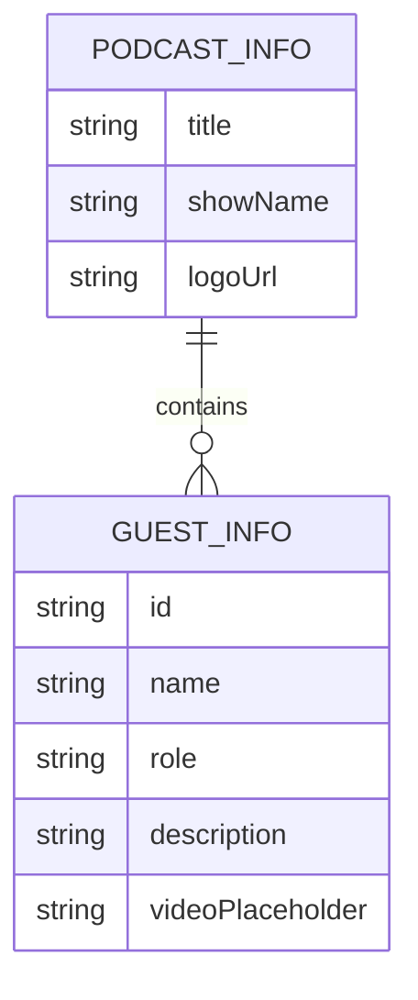

# 视频播客画面模板页面 - 技术架构文档

## 1. Architecture design



## 2. Technology Description

* Frontend: React\@18 + TypeScript\@5 + Vite\@5 + Tailwind CSS\@3

* Backend: None

## 3. Route definitions

| Route | Purpose                    |
| ----- | -------------------------- |
| /     | 主展示页面，显示播客标题、节目信息和三列视频展示区域 |

## 4. Data model

### 4.1 Data model definition



### 4.2 Data Definition Language

由于项目使用静态数据，以下为TypeScript接口定义：

```typescript
// 播客信息接口
interface PodcastInfo {
  title: string;           // 播客标题
  showName: string;        // 节目名称
  logoUrl?: string;        // 节目Logo URL（可选）
}

// 嘉宾信息接口
interface GuestInfo {
  id: string;              // 嘉宾唯一标识
  name: string;            // 嘉宾姓名
  role: string;            // 角色（主播/嘉宾）
  description: string;     // 角色描述
  videoPlaceholder?: string; // 视频占位图片URL（可选）
}

// 页面数据接口
interface PageData {
  podcastInfo: PodcastInfo;
  guests: GuestInfo[];
}
```

初始数据：

```typescript
const initialData: PageData = {
  podcastInfo: {
    title: "No.81 和 OpenBuilder 许银聊 2025 年的 Web3 学习、成长路径",
    showName: "Web Worker"
  },
  guests: [
    {
      id: "xinbao",
      name: "辛宝",
      role: "主播",
      description: "Web3 小白"
    },
    {
      id: "xuyin",
      name: "许银",
      role: "嘉宾",
      description: "OpenBuilder Co-Funder"
    },
    {
      id: "smart",
      name: "Smart",
      role: "主播",
      description: "Web3 小白"
    }
  ]
};
```

